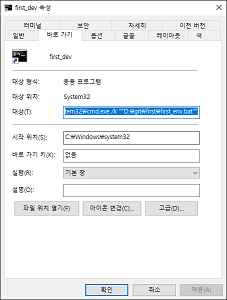
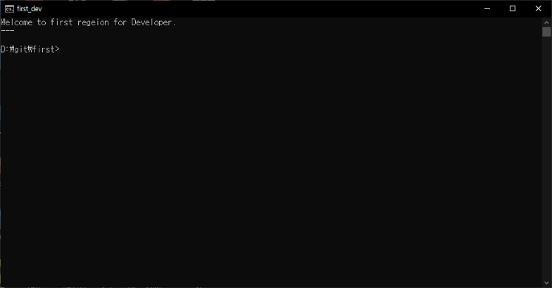

# Git의 시작

## Git
버전관리 도구
### Reference site
- [왕초보를 위한 깃과 깃허브 사용 튜토리얼]( https://xiubindev.tistory.com/113)
- [깃 메뉴얼](https://git-scm.com/book/ko/v2/)

### 개 요
1. Git의 개념도

2. 개념의 이해 및 자유도를 높이기 위해서는 콘솔을 사용하라는 조언에 의하여 콘솔을 사용해봅니다.

### [Management of Git version]
##### git config
최초 1회에만 실행하는 것으로 유저의 이름과 이메일을 입력합니다. 본인의 경우에는 얼떨결에 먼저 실행한 것같습니다. 차후 기입력내용을 수정하는 방법에 대해서 알아봐야 겠습니다.
```
git config --global user.name "kohenil"
git config --global user.email "kohenil97@gmail.com"
```
##### git init
git의 초기화, 버전관리를 원하는 폴더의 위치에서 실행
초기화시 생성된 .git폴더는 버전관리를 진행할 폴더이다.(절대 삭제하지 말것!!!)
`git init`
##### git status
저장소의 상태
`git status`
##### git add
```
git add [파일명, 폴더]
git add .
```
##### git commit
1) -m [message] 메시지를 작성하여 버전을 생성
2) -am [message] add & commit을 한번에 수행
3) --amend 이전 commit message를 편집기를 통하여 수정
```
git commit -m "first commit"
git commit -am "first commit"
git commit --amend
git commit  : 여러줄의 커밋 메시지를 편집기를 통해 편리하게 작성
```
##### git log
1) local repository의 history를 탐색한다
2) --stat : 버전마다 관련된 파일들을 그롭핑하여 확인 할 수 있다.
3) -p : 아주 복잡한 코드일 경우 문제가 생긴 코드를 추적할 때 확인하기 좋다.
##### git checkout
```
git checkout [commit ID]  : 해당 커밋ID를 입력하면 그 커밋의 작업시점으로 돌아갈 수 있다.
git checkout [brench] : local repository에서 해당 brench로 전환한다
```
##### git diff
```
git diff  : 변경사항을 볼 수 있다. commit하기 전에 활용
```
##### git reset
```
git reset --hard [원하는 version commit ID]  : 현재 작업 내용을 삭제하고 원하는 version으로 복원할 수 있슴
git reset --hard HEAD^  : 최종커밋을 취소하고 파일 까지 복구한다.
```
##### git revert
```
git revert [현재버전 commit ID]  : 기존의 커밋은 내버려두고 이전 커밋으로 복원
```
### [Git branch & conflict]
##### git branch
```
git branch  : display branches
git branch [branch name]  : make branch [branch name]
git checkout [branch name]  : move to [branch name]
```
##### git --all --graph --oneline
모든 branches를 한줄씩 그래프 형태로 볼수 있는 명령어
`git log --graph --oneline -15 --no-decorate`
##### merge method
```
git checkout [main branch name]
git merge [branch name]
```
### [Git Backup]
```
git remote add [원격저장소 이름] [자신의 원격저장소 주소]
git remote -v
git push [이름] [브랜치명]
git clone [원격저장주소] [원하는 폴더이름(생략가능)]
git pull
```
## Other
### Configure
##### Batch File 만들기
batch file의 내용은 아래와 같습니다.
```
ECHO OFF
CLS
cd [프로젝트의 main directory]
F: (프로젝의 drive로 이동)
ECHO Welcome to first regeion for Developer.
ECHO ---
ECHO ON
```

##### window cmd 바로가기
1. 바탕화면에서 바로가기를 만들고, 그림과 같이 바로가기의 대상에 아래의 내용을 입력하고 확인합니다.

`C:\Windows\system32\cmd.exe /k ""[오픈시 실행할 batch file]""`
2. 그리고 실행하면, 짜잔~ !

